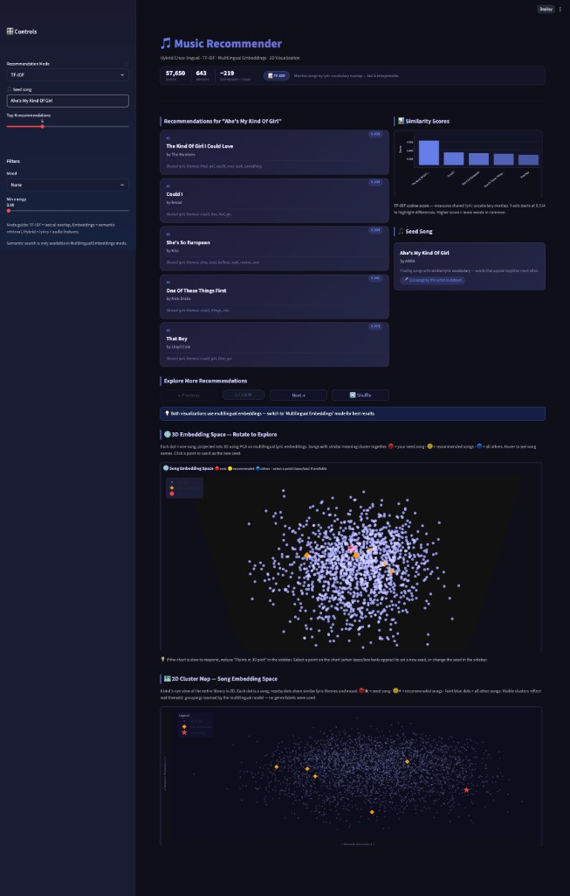

# 🎵 CS5100 Music Recommender

**Cross-lingual · TF-IDF · Multilingual Embeddings · Hybrid Audio+Lyrics · 3D Visualization**

A content-based music recommendation system built for CS 5100 (Foundations of AI). Supports three recommendation modes — TF-IDF lyric similarity, multilingual sentence embeddings (cross-lingual), and a hybrid lyrics + audio features model — with an interactive Streamlit interface featuring semantic search, explainable recommendations, and 3D/2D embedding visualizations.

## App Preview



---

## Project Structure
- `app/preprocess.py`: cleans lyrics and builds `cleaned_text`
- `app/tfidf_recommender.py`: baseline TF-IDF recommender
- `app/embedding_recommender.py`: multilingual embedding recommender with FAISS
- `app/hybrid_recommender.py`: lyrics + audio hybrid recommender
- `app/explainability.py`: simple XAI explanation generator
- `app/visualization.py`: optional 3D embedding visualization with UMAP and Plotly
- `app/streamlit_app.py`: Streamlit UI
- `scripts/build_artifacts.py`: builds `data/processed/cleaned_lyrics.parquet` and (if present) `spotify_audio_features.parquet`
- `scripts/merge_audio_features.py`: rebuilds only the audio-features parquet from a Kaggle CSV (fast; no lyric NLP pass)

## Expected files
Place raw CSVs under **`data/raw/`** (see `app/config.py`):
- `data/raw/spotify_millsongdata.csv` — Million Song lyrics (`artist`, `song`, `text`, …)
- `data/raw/spotify_songs.csv` — optional; Spotify audio-features table (`artists`/`track_name` or `artist`/`song` + `energy`, `valence`, `tempo`, …). Common sources: [Kaggle mrmorj/spotify](https://www.kaggle.com/datasets/mrmorj/dataset-of-songs-in-spotify) or similar.

Processed outputs go to **`data/processed/`**:
- `cleaned_lyrics.parquet`
- `spotify_audio_features.parquet` (enables hybrid mode in the app)

## Install
```bash
pip install -r requirements.txt
```

## Prepare data
```bash
# Default: reads data/raw/spotify_millsongdata.csv; if data/raw/spotify_songs.csv exists, writes audio parquet too.
python -m scripts.build_artifacts

# Custom locations (e.g. file still in Downloads):
python -m scripts.build_artifacts --lyrics ~/Downloads/spotify_millsongdata.csv --audio ~/Downloads/spotify_songs.csv

# Audio CSV only (after lyrics parquet already exists):
python -m scripts.merge_audio_features --audio ~/Downloads/spotify_songs.csv

# Merge two Spotify chart CSVs (e.g. April2019 + Nov2018), April first so duplicate `track_id` keeps the newer file:
python -m scripts.merge_audio_features --audio \
  ~/Downloads/archive\ \(5\)/SpotifyAudioFeaturesApril2019.csv \
  ~/Downloads/archive\ \(5\)/SpotifyAudioFeaturesNov2018.csv
```

## Run the app (correct entry point)
```bash
streamlit run app/streamlit_app.py
```

> **Note:** `src/data_pipeline.py` and `main.py` are early scaffolding files and are **not runnable** (`load_and_clean_data` raises `NotImplementedError`). All functional code lives under `app/` and `scripts/`.

## How the app works

The Streamlit app in `app/streamlit_app.py` follows this flow:

1. Load lyrics data
   - Prefer `data/processed/cleaned_lyrics.parquet`
   - Fall back to `data/raw/spotify_millsongdata.csv` and build `cleaned_text` on the fly
2. Build or load the selected retrieval model
   - `TF-IDF`: vectorizes `cleaned_text` with `TfidfVectorizer`
   - `Multilingual Embeddings`: encodes lyrics with `sentence-transformers/paraphrase-multilingual-MiniLM-L12-v2`
   - `Hybrid`: merges lyrics with audio features and combines lyric TF-IDF + numeric audio features
3. Apply user controls from the sidebar
   - recommendation mode
   - seed song
   - top-`k`
   - mood filter (`None`, `Gym`, `Calm`)
   - minimum energy threshold
   - optional semantic prompt for embedding search
4. Generate recommendations
   - TF-IDF and Hybrid recommend from a seed song
   - Embedding mode supports both seed-song search and free-text semantic search
5. Explain and visualize results
   - recommendation rationale text
   - interactive 3D embedding plot
   - 2D cluster overview

## Recommendation modes

### TF-IDF
- Uses lyric vocabulary overlap on `cleaned_text`
- Fastest and easiest to interpret
- Best for exact wording, repeated themes, and lexical similarity

### Multilingual Embeddings
- Uses dense sentence embeddings for each song lyric
- Supports cross-lingual / semantic matching better than plain TF-IDF
- Uses FAISS when available for faster nearest-neighbor lookup

### Hybrid
- Uses lyric TF-IDF plus Spotify-style audio features
- Default audio features include `tempo`, `energy`, and `valence`
- Falls back to lyrics-only behavior if audio parquet is missing or a song is outside the matched audio subset

## Generated artifacts and caching

The project creates and reuses several artifacts under `data/processed/`:

- `cleaned_lyrics.parquet`: cleaned lyrics dataset
- `spotify_audio_features.parquet`: standardized audio-feature table
- `hybrid_merged.parquet`: preview of the inner join between lyrics and audio
- `multilingual_embeddings.npy`: cached embedding matrix
- `merged_dataset.parquet`: metadata saved alongside embeddings

The Streamlit app caches:

- loaded lyrics data
- TF-IDF model
- embedding model and nearest-neighbor index
- hybrid model
- 3D projection coordinates

This keeps reruns much faster after the first load.

## Quantitative evaluation (for report Results section)
Run a quick baseline comparison between TF-IDF and Embedding recommenders:
```bash
python -m scripts.evaluate_recommenders --top-k 5 --n-queries 200
```
This writes a metrics table to `results/evaluation_metrics.csv` with:
- `precision@k`
- `recall@k`
- `ndcg@k`

Evaluation logic:
- samples seed songs from artists that have at least 2 songs in the dataset
- treats other songs by the same artist as the relevant set
- compares TF-IDF vs Embedding recommenders on the same sampled queries

This is a lightweight proxy evaluation for the report, not a user-study or human-labeled relevance benchmark.

## Important implementation details

- Lyrics preprocessing removes punctuation, lowercases text, tokenizes it, and removes English stopwords before creating `cleaned_text`.
- Audio CSV standardization is flexible: the code accepts common Kaggle column variants such as `artists`/`track_name` or `artist`/`song`.
- Audio tables are deduplicated on normalized `(artist, song)` pairs, or on `track_id` first when merging multiple Spotify CSV archives.
- The 3D and 2D visualizations currently use PCA projections for stability inside Streamlit, even though some older naming still references UMAP.
- Embedding artifacts are saved after first build so later app launches can skip recomputing the full embedding matrix.

## Notes
- Hybrid mode requires **`data/processed/spotify_audio_features.parquet`** (created by the scripts above). Merge keys are **`artist` + `song`**, matched case-insensitively after stripping whitespace.
- If audio features are missing, the app falls back to lyrics-only hybrid scoring and shows a warning in the UI.
- The `compute_umap_coords` function uses **PCA** (not UMAP) for 3D/2D projection. UMAP caused Numba/Streamlit runtime conflicts; PCA was adopted as a stable alternative. The function name is retained from an earlier iteration.
- Seed-song lookup in the UI is currently title-based. If duplicate song names exist across artists, the first matching title is used.
- `app/streamlit_app2.py` exists as an alternate/older UI file, but `app/streamlit_app.py` is the main maintained entry point documented here.
